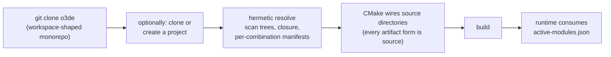
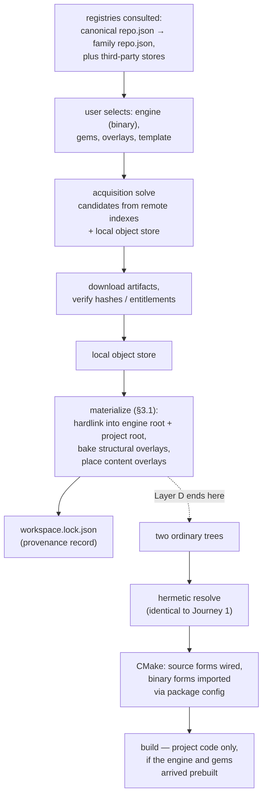

# RFC: O3DE Schema 2.0.0 — A Layered Object Model

> **Positioning**: This document is a response to the [Monorepo-First proposal](https://gist.github.com/ericliusunniy/5ed1d4e842071584aeda9d552d4bea24) and a synthesis of that proposal with the implemented [O3DE 2.0.0 Object Model](https://github.com/accesspointmg/org.o3de.repo.o3de/blob/development/rfc/o3de-2.0.0.md). It proposes **one schema in four separable layers**: a source-tree core that adopts Monorepo-First's discovery, enablement, override, module, and loading semantics substantially whole, and an optional distribution layer that gives the launcher, binary consumers, restricted-platform delivery, and third-party vendors an open contract instead of a private one.
>
> **Key constraint**: Nothing in the distribution layer may alter the behavior of the core. Configuration, validation, and building are offline, deterministic, and consume only the checked-out engine and project trees. A tree that carries no distribution metadata behaves exactly as Monorepo-First specifies, byte for byte.
>
> **Canonical copy**: [`rfc/o3de-2.0.0-layered.md`](https://github.com/accesspointmg/org.o3de.repo.o3de/blob/development/rfc/o3de-2.0.0-layered.md) · **Published gist** (revisions tracked): <https://gist.github.com/byrcolin/52990b0f48049820cbedab8736dd16e7>

In this document, **MUST**, **MUST NOT**, **SHOULD**, **SHOULD NOT**, and **MAY** are to be interpreted as described in [BCP 14](https://www.rfc-editor.org/info/bcp14) ([RFC 2119](https://www.rfc-editor.org/rfc/rfc2119) and [RFC 8174](https://www.rfc-editor.org/rfc/rfc8174)), and are normative only in bold uppercase form.

---

## Preface: Where the Two Proposals Actually Disagree

The Monorepo-First proposal is a serious, carefully constructed piece of work, and this document engages it as such. Both proposals descend from [rfcs#53](https://github.com/o3de/rfcs/issues/53) and already agree on the foundation: objects described by uniform JSON documents with `$schema`/`$schemaVersion` headers; stable identity (`name`, `id`, `version`); SPDX license lists; structured dependencies; sidecar files and mechanical mapping for 1.x migration; a single normative resolution implementation shared by the CLI, the GUI, and CMake; and offline, deterministic configuration.

Beyond that foundation, Monorepo-First contributes a body of design the 2.0.0 line did not have and should adopt: two-tier engine/project discovery with physical and effective scope; the `required_gems` / `default_enabled_gems` / `gem_references[]` enablement model; explicit, audited `gem_overrides[]`; module descriptors with types, loading phases, load-dependency DAGs, and triple gating; `unique_services[]`; per-build-combination generated artifacts; and a disciplined phased rollout with shadow validation. Section 2 adopts these into the unified schema essentially as specified.

What remains in dispute after those adoptions is far smaller than either document read alone suggests. It reduces to three questions, answered here in the same order the Monorepo-First preface raises them.

### 1. On splitting the repository: conceded, and resolved by projection

Monorepo-First is right that presenting the repository split as an implicit prerequisite or end state of a schema upgrade was a sequencing error, and right that the atomic cross-component commit is the only cross-component regression barrier O3DE currently has. Its own principle **P8** — *Schema and repository governance are separate* — is correct, and this synthesis adopts it symmetrically: the schema neither requires a split nor forbids one. The unified object model **MUST** be provable in a monorepo, and the O3DE main repository **MUST** be able to adopt Schema 2.0.0 fully without being split.

The severable question — how consumers obtain per-object checkouts and per-object releases — is answered without giving up the atomic commit, using a model with a long production record (Symfony's component splits, Laravel's `illuminate/*` packages):

- The monorepo remains the **development venue**: one PR, one CI run, one revertible commit, exactly as today;
- Object family repositories are **automated, read-only projections** of monorepo subtrees, regenerated by deterministic history filtering on each release (or each merge to `development`);
- Projections are read-only in the strict sense: no commit lands on one directly, so there is no divergence and no cross-repo merge ordering. Contributions **MAY** still be accepted *through* them: a pull request opened against a projection is imported onto the monorepo by automation, reviewed and CI-tested there as one atomic change, and flows back out with the next regeneration. This is a model with a decade of production history (Meta's FBShipIt; React and PyTorch accepted GitHub contributions this way for years while developing in a monorepo);
- Projections carry no independent maintainer roster, triage queue, or CI budget; review, CI, and security response happen only on the monorepo. The governance cost Monorepo-First's preface prices at ~120 independent repositories does not arise, because the projections are not independent — they are that many approachable front doors to one repository;
- Per-object releases are cut from projections, so a consumer can clone, pin, or receive one gem without a tens-of-gigabytes engine clone.

The 117 `org.o3de.repo.*` family repositories already extracted demonstrate that the projection is mechanical and history-preserving. What that exercise also demonstrated — recorded as an open question in the 2.0.0 RFC — is that filter provenance (kept paths, renames, tool version, source commit) must be persisted for the projection to be repeatable. The projection model makes that persistence a requirement rather than an afterthought, and turns "extraction" from a one-way migration into a continuously regenerated view.

To be explicit about what is and is not being claimed: keeping the monorepo as the development venue is a judgment about O3DE's present contributor and CI capacity, not a claim that monorepo development scales indefinitely — a whole-tree CI run per pull request is already the project's most visible bottleneck, and it grows with the tree. The projection model is chosen precisely because it makes that judgment revisable at zero architectural cost: a family whose maintainership, CI scope, and release cadence outgrow the monorepo **MAY** graduate to independent development in its already-existing projection repository, one family at a time, without any change to the schema, the tooling, or the other families. Under this model the monorepo-vs-split question stops being a constitutional decision and becomes an operational dial.

### 2. On engine Gems vs. external Gems: adopted as effective scope; the engine object remains, because the launcher needs it

Monorepo-First is right that in-tree gems and externally released gems have different compatibility facts, and its resolution — same `gem.json`, difference determined by discovery location, layering enforced by effective scope, in-tree gems permitted to omit `engine_compatibility` and inherit the commit they live in — is elegant. This synthesis adopts it, including the `"engine_compatibility": "inherited"` artifact marker.

What this synthesis does not adopt is the conclusion that the engine must therefore not be an addressable, versioned object. Monorepo-First's own §11.1 already models the engine as exactly that: `registered_engines[]` entries carrying a stable `id`, a `name`, a SemVer `version`, and a path, with multi-version coexistence and explicit disambiguation. That *is* the engine object, in local form. The only capability the 2.0.0 line adds is that the same identity can also be **released**: a versioned artifact a launcher can enumerate, download, verify, install, and register — after which it is an ordinary entry in the same index, selected by the same rules.

The Monorepo-First preface itself proposes "a launcher along the lines of the Epic Games Launcher" managing "multiple local engine installations and versions." Epic's launcher can do that because Epic's engine is a released, versioned, binary-distributable artifact. An engine that exists only as a Git checkout can be *registered* by such a launcher but never *delivered* by one. Treating the engine as a releasable object is not a demotion; it is the prerequisite for the launcher experience both proposals want.

### 3. On npm/pip-style over-engineering: the machinery is smaller than it looks, the need is real, and the cost is already paid

Four observations, offered in the same spirit of engineering economics the Monorepo-First preface applies.

**First, the disputed machinery degenerates to Monorepo-First's own semantics in the monorepo case.** A PubGrub-style resolver given inputs where every dependency has exactly one local candidate performs no enumeration, no backtracking, and no selection: it computes the closure and checks the assertions — which is precisely Monorepo-First's R1–R2 pipeline. This synthesis makes that degeneration normative (§4, rule D4): when all candidates are local and unique, resolution **MUST** reduce to closure computation plus compatibility assertion, with no candidate enumeration. The monorepo developer's daily path is identical under both proposals; the solver is reached only when there is genuinely something to choose between, which is exactly when a human choosing by hand is at their worst.

**Second, the launcher and Marketplace that Monorepo-First relies on need this metadata anyway — the only question is whether it is specified in the open.** Its preface assigns browsing, acquisition, downloads, and integrity to a launcher-layer Marketplace, "a product feature, not a build contract." But a Marketplace that enumerates versions, selects platform-appropriate artifacts, verifies downloads, and places gems into trees requires, at minimum: a remote index format, per-version artifact records, content hashes, and platform tokens. Either that format is openly specified — at which point it is `releases[]` and `repo.json` under another name — or it is a private format owned by a product team, unreviewable by the RFC process that governs everything else. UE5 is the cautionary example here, not the model: Fab's metadata is proprietary and closed, which an open-source project should not reproduce. This synthesis keeps the acquisition contract open, while adopting Monorepo-First's boundary completely: the contract's *only* output is files in a local tree plus one root entry (§4, rule D3) — which is, verbatim, what its own preface says acquisition should do.

**Third, prebuilt binaries are not an optimization; for part of the ecosystem they are the only legal form — and O3DE already consumes them on every configure.** Commercial middleware (audio, video, physics, platform SDKs) ships under NDA as binaries; console platform layers cannot appear in a public tree at all — that is why `restricted` exists. A schema whose only channel is "the source is already in your tree" has no answer for a vendor who may not give you source, other than an unspecified manual graft. Nor is prebuilt consumption hypothetical for O3DE: the build cannot configure today without the 3rdParty package system downloading hash-verified prebuilt binaries from a versioned index — a package manager in all but name, running at the base of the stack, and carried by Monorepo-First as an explicit exception ("excluding external SDKs that the toolchain itself declares separately"). The question is therefore not whether O3DE consumes prebuilt packages, but whether gems and engines receive the same capability through an openly specified format, or prebuilt consumption remains a privileged exception below the schema's line of sight. A vendor can even smuggle binaries through Monorepo-First's model unaided — a source-shaped gem whose build script declares imported targets over bundled libraries wires in like any other — but with no delivery channel, no integrity verification, no entitlement model, no platform-variant selection, and an `abi_fingerprint` that records the consumer's toolchain rather than the artifact's actual ABI, so the mismatch passes silently. The need does not disappear when the schema declines to specify it; it degrades into private, unauditable practice. Separately, the largest documented adoption obstacle O3DE has is the cost of source-only assembly: a multi-hour full engine build before the first triangle renders. Monorepo-First lists binary packages as a non-goal, which is a legitimate scoping decision for a *core* schema — and this synthesis honors it by keeping every binary concept out of the core (§3). But the product cannot list it as a non-goal, and the layer that carries it should be specified with the same rigor as everything else.

**Fourth, the implementation exists.** The solver, release channels, binary packaging and consumption, manifest-driven CMake build, and schema/mapping publication run today (o3de-cli, 1055 tests passing; a full Editor build from a manifest-driven configure; the engine branch merged with upstream through `2510.2`). Monorepo-First's §14.0.2 already reaches the right conclusion — keep and rework o3de-cli rather than build a second implementation — and this synthesis reciprocates by adopting its phase structure and RFC split (§6). The economic argument against building distribution machinery at O3DE's scale does not apply to machinery already built; the residual cost is maintenance, which the layering below confines to the one RFC that distribution consumers read.

The residual disagreement, then, is exactly two questions: **(a)** is acquisition metadata an open, versioned part of the specification or a private product format; **(b)** are prebuilt artifacts in scope for the specification at all. This document answers *open* and *yes*, and confines both answers to a layer the monorepo never has to load.

---

## 0. Summary

Schema 2.0.0 is specified as four layers, delivered as four independently mergeable RFCs. Layers A–C are Monorepo-First's RFC-A/B/C, adopted with the amendments in §2. Layer D is new to the split but not to the ecosystem: it is the open specification of acquisition and release.

| Layer | RFC | Contents | Consumers |
|---|---|---|---|
| **A — Objects and resolution** | RFC-A | Core descriptors (`engine`, `project`, `gem`, `overlay`, compat `template`); identity; SemVer comparator set; two-tier discovery; enablement; overrides; unique services; per-combination `resolved-gems.json` | Every tool, every tree |
| **B — Modules and loading** | RFC-B | `modules[]`, module types, loading phases, load DAG, triple gating, content capability, `active-modules[.plan].json`, `active-content.json`, CMake target-graph validation | Build system, runtime, Project Manager |
| **C — Overlays and override auditing** | RFC-C | Unified overlay model (§5), `module_sources[]`, conflict policy, restricted migration, override audit | Restricted platforms, local patches |
| **D — Distribution and releases** | RFC-D | `repo.json` indexes, per-object release records (three channels: source control, source archive, binary), content hashes, platform/ABI tokens, acquisition tooling, engine-as-installable-object, distribution lockfiles | Launcher/Marketplace, binary consumers, vendors, restricted delivery |

The load-bearing rule is the bridge between D and the rest (§4): **no distribution field appears in any core descriptor; configure and build never read Layer D data or the network; acquisition's only output is a valid local tree.** After acquisition, a distribution consumer and a monorepo developer are indistinguishable to Layers A–C.

---

## 1. Goals

Goals **G1–G8** of Monorepo-First are adopted verbatim (monorepo-native; two-tier ownership; determinism; offline validity; engine independence; loading behavior described; incremental migration; multi-version coexistence across closures). This synthesis adds:

- **G9: Open acquisition.** The metadata by which an engine, gem, or overlay is found, versioned, fetched, and verified is part of the public specification, not a private product format.
- **G10: Binary consumability.** An object **MAY** be released as a prebuilt, platform-tagged, hash-verified artifact, and the build **MUST** be able to consume such an artifact in place of compiling its source, without any change to Layer A–C semantics.
- **G11: Topology neutrality.** The schema is provable in a monorepo (G1) and equally valid over projected per-object repositories; neither topology is a prerequisite of the other.
- **G12: One implementation.** All four layers are implemented in one codebase (o3de-cli and its CMake integration), per Monorepo-First §14.0.2 and the 2.0.0 line's tooling consolidation.

---

## 2. Adopted from Monorepo-First

The following are adopted as normative for the unified schema, with source sections cited so the two documents can be read side by side. Where the 2.0.0 implementation differs today, the implementation changes, not the specification.

| Adopted | Source | Notes and amendments |
|---|---|---|
| Two-tier discovery; `gem_roots[]`/`build_roots[]`/`overlay_roots[]`; in-repository root restrictions; scan-ordering and Unicode rules | §4 | Adopted whole. User-level `external_subdirectories[]` loses resolution semantics per §12.5 |
| discovered / enabled / active; `required_gems[]` vs `default_enabled_gems[]`; structured `gem_references[]` with reference-level gating | §5.1–5.3 | Adopted whole; replaces the 1.x `gem_names[]` model in the 2.0.0 line |
| `dependencies[]` with `required`/`optional` kinds and compatibility assertions; layering by effective scope; cycle detection | §5.4–5.6 | Adopted whole |
| `unique_services[]` as a static post-resolution check, never a solver input | §5.7 | Adopted whole, including migration of 1.x `provided_unique_service` |
| Explicit `gem_overrides[]` with `replaces_id`, effective-scope promotion, `reason`, CI audit, `public_tests[]` | §6 | Adopted whole |
| `engine_compatibility` optional for engine-physical-scope gems (`"inherited"`); `engine_api_compatibility`; `name_aliases[]`; `host_ids` | §7, §3.3.1 | Adopted, with one Layer-D bridge rule: an object packaged for independent release **MUST** declare explicit compatibility — `inherited` is unpackageable (rule D5) |
| Module descriptors: types, linkage, loading phases, `load_dependencies[]` hard/soft edges, triple gating, content capability | §8 | Adopted whole |
| Per-combination artifacts (`resolved-gems.json`, `active-modules.plan.json`, `active-modules.json`, `active-content.json`); single resolution entry point; CMake wiring order and target-graph validation; runtime closed world | §10 | Adopted, with one extension required by G10: an object whose resolved artifact form is *binary* is not wired as a source directory but imported through its install layout's `<name>Config.cmake` — offline, from the local tree, never the network. Both forms **MUST** export identical `Gem::<name>` targets, so the rest of the graph cannot observe the difference; ownership marking and link-edge validation for imported targets derive from the manifest and the binary's declared dependencies and public link interface. In a tree with no Layer D data every artifact form is source, the import path is unreachable, and §10.2 semantics hold unmodified. These artifacts are build intermediates, not lockfiles; lockfiles exist only in Layer D (rule D6) |
| Multi-engine registration by canonical path; explicit engine selection; `source_revision` pinning; invalidation keys; reproducibility modes | §11 | Adopted whole. A launcher-installed binary engine registers as an ordinary index entry |
| Sidecar selection algorithm; field mapping; `legacy-engine-version-map.json`; shadow validation; user-manifest disposition incl. o3de-extras | §12 | Adopted whole; extends the 2.0.0 line's existing sidecar/mapping mechanism |
| Stable error-code discipline; complete reference chains in diagnostics | §13 | Adopted; Layer D allocates its own code range rather than overloading E20xx |
| Phased rollout with shadow validation and per-phase acceptance; RFC split; o3de-cli as the implementation vehicle | §14 | Adopted and extended with a parallel D track (§6) |
| Restricted-comparator SemVer set with the prerelease admission rule | §3.3 | Adopted for compatibility assertions *and* reused by Layer D for candidate admission, so both layers share one version grammar |

Two elements of the 2.0.0 line are **superseded** by the above and are withdrawn:

- **Workspaces as a core concept.** In a source tree, the engine tree and project tree are consumed directly (Monorepo-First §2.3). What the 2.0.0 line called a workspace survives only inside Layer D as the *materialization step of acquisition* — the hardlink/staging assembly that turns a resolved closure into an ordinary local tree (§3.1) — and is invisible to Layers A–C.
- **Overlay auto-selection by criteria at compose time.** Enablement of overlays in a tree is explicit via `enabled_overlays[]` (Monorepo-First §9.2). Criteria matching (`--platforms`, tags) survives only in Layer D as an *acquisition-time* convenience for choosing which overlay objects to fetch; it never implicitly applies an overlay.

---

## 3. Retained from the Object Model — relocated out of the core

The 2.0.0 line's distribution capabilities are retained in function and **relocated in form**. This relocation is a direct concession to Monorepo-First §16.1, which argued that registry and release fields in the core schema force every tool and test to carry two models. Under this synthesis they no longer can:

- **No distribution field in core descriptors.** `releases[]` and everything it carries (URIs, hashes, platform tokens, ABI floors) move out of `gem.json`/`engine.json`/`overlay.json` into Layer D documents: the family `repo.json` index and per-object release records. A core validator never sees them; a core descriptor with a distribution field is *invalid*.
- **Three release channels** (git ref, source archive, prebuilt binary) are retained as specified in the 2.0.0 RFC, per version, per platform (`<OS>.<ARCH>` tokens, optional ABI floors such as `glibc`). Binary archives are install layouts carrying a `<name>Config.cmake`, imported by the build instead of compiled — the one Layer-D fact the build can observe, recorded in `resolved-gems.json` as the resolved artifact form.
- **Registry indexes** (canonical + third-party, curated/uncurated tiers) are retained as Layer D. A repo index is itself an object, so any organization can host one with the same format — this is the open Marketplace contract of Preface §3. A registry **MAY** be commercial: it **MAY** require accounts or entitlements to dereference artifact URIs and **MAY** carry commercial terms alongside its entries, but version records, release metadata, hashes, and integrity verification **MUST** use the open format — entitlement gates the download, never the schema. This is the Marketplace the Monorepo-First preface itself calls for ("browsing, search, categorization, ratings, license and provenance display, one-click acquisition … accounts, and commercial terms"), specified openly so that competing stores can exist and interoperate rather than each inventing a private format; it is also the only conforming delivery form for commercial objects that cannot ship source. Repo objects are additionally how **object families** cohere in distribution: a family repository (typically a projection, Preface §1) advertises its children and their releases through `repo.json`, and the index hierarchy (canonical → family → object) is how registries, stores, and the launcher navigate the ecosystem. Inside a checked-out or materialized tree no repo object is needed — family cohesion there is ordinary directory grouping under a discovery root (Monorepo-First §4.1), and a `repo.json` present in a tree (for example at the root of a workspace-shaped monorepo) is Layer D data that configure never reads (rules D1/D2).
- **Distribution lockfiles** are retained as the definition of a product release: "O3DE 26.05" is a pinned, tested closure of object releases (`releases/<version>.lock.json`), which is what a release *is* once objects version independently. Build-directory artifacts remain non-lockfiles, exactly as Monorepo-First specifies.
- **The local object store and its inventory** are retained as Layer D state: downloaded releases, locally built packages (`~/.o3de/BuiltPackages/`, discovered by filesystem convention with no registration step), and explicitly registered development checkouts. The inventory is consulted only by acquisition-time solving and materialization (§3.1), never by configure — structurally the same contract as Monorepo-First's own `registered_engines[]` index (§11.1) and its retained project/template indexes (§12.5), which participate in selection and display but not in resolution. What is removed, in agreement with Monorepo-First, is implicit registration as a resolution input: user-level `external_subdirectories[]` and every other mechanism by which an unregistered-in-tree path on one machine could silently alter a team's configure results.
- **Packaging and publication tooling** (`o3de object build/install/package/publish`) is retained as the producer side of Layer D.
- **The engine as a releasable object** is retained (Preface §2): the launcher enumerates engine releases from an index, installs one, verifies it, and registers it in the §11.1 engine index like any checkout.

### 3.1 Materialization: composition's output is two ordinary trees

The 2.0.0 line's workspace composition survives intact inside Layer D; what changes is the shape of its output. A resolved closure materializes as an ordinary **engine root** and **project root** — hardlinked from the local object store, so N trees sharing an object cost one physical copy — with acquired gems placed under `gem_roots[]`, acquired overlays placed under `overlay_roots[]` and listed in `enabled_overlays[]`, and the pinned closure recorded beside the trees as a Layer D provenance record that configure never reads (rules D2/D3/D6):

```text
MyWorkspace/
├─ o3de/                      # engine root: binary install layout or source checkout
│  ├─ engine.json
│  ├─ Gems/
│  │  ├─ PhysX/               # hardlinked from the object store, binary form
│  │  └─ Atom_RPI/            # hardlinked from the object store, source form
│  └─ Overlays/
│     └─ PhysXWindows/        # placed as an overlay object, applied per §5
├─ MyGame/                    # project root
│  ├─ project.json            # engine binding, gem_references[]
│  └─ Gems/
└─ workspace.lock.json        # Layer D record; not a configure input
```

From the moment materialization completes, Layers A–C see nothing but a conforming engine tree and project tree, with the same discovery, enablement, override, overlay, and build semantics as a monorepo checkout. Materialization **MAY** optionally bake selected content overlays into the target object's directory for a fixed platform selection — in which case the baked tree **MUST** be byte-identical to the §5 virtual view of the corresponding build combination — and **MUST** apply structural overlays (§5) this way, since they have no virtual form; consumed overlays of either tier are recorded in the provenance record, preserving the 2.0.0 line's guarantee that a composed tree is layout-identical to the pre-split object. Composition is therefore not an alternative to the two-tier model; it is how two-tier trees come into existence for every consumer who did not clone one.

---

## 4. The bridge rules

The two layers compose under six normative rules. These are the whole interface; everything else in Layers A–C proceeds as if Layer D did not exist.

- **D1 — Separation of documents.** Distribution metadata **MUST NOT** appear in core descriptors; it lives in Layer D documents (indexes, release records, lockfiles). Core tools **MUST** validate trees identically whether or not Layer D data is present anywhere on the machine.
- **D2 — Hermetic configure.** Configuration, validation, generation, build, and runtime **MUST NOT** read Layer D documents, remote indexes, or the network, and **MUST NOT** download, install, or substitute anything. (Monorepo-First G3/G4/§11.4, adopted verbatim.) The only Layer D residue visible at configure time is the artifact form already materialized on disk.
- **D3 — Acquisition lands in the tree.** The only permitted effects of acquisition tooling are: files placed in an engine or project tree (or a new registered engine root), one root/reference entry written, and a provenance record (source index, version, hashes, date). After acquisition, the tree **MUST** be valid under Layers A–C with no memory of how it got there.
- **D4 — Degeneration.** Within one closure, one name resolves to exactly one instance (Monorepo-First P5, adopted). When every dependency has exactly one local candidate, resolution **MUST** degenerate to closure computation and compatibility assertion, with no candidate enumeration. Candidate enumeration and solving occur only inside explicit acquisition or upgrade commands, where their output is a proposed set of tree changes for the user to accept.
- **D5 — Explicit compatibility at the boundary.** Packaging an object for independent release **MUST** fail unless the object declares explicit `engine_compatibility` (or is the engine); `inherited` is a monorepo fact and does not travel.
- **D6 — Lockfiles only at the distribution layer.** Per-combination build artifacts are deletable intermediates. Pinned closures exist only as Layer D distribution lockfiles, produced by a release process, never by a configure.

### 4.1 The bridge rules in practice: three user journeys

**Journey 1 — the monorepo developer.** Clone and go; Layer D is never touched.



Discovery scans `<engine>/Gems` and `<project>/Gems`; enablement comes from `required_gems[]`, `default_enabled_gems[]`, and `gem_references[]`; resolution degenerates to closure computation plus assertions (rule D4). The `repo.json` at the monorepo root is inert cargo (rule D2); no index, store, solver candidate set, or lockfile is consulted; the only downloads are the existing 3rdParty toolchain SDK packages, unchanged. This journey is Monorepo-First's semantics, unmodified.

**Journey 2 — the composition consumer.** The launcher, a store, or the CLI assembles trees from projections; the dashed line is the Layer D boundary, and everything below it is Journey 1.



Every step above the dashed line is an explicit user action (rule D3); every step below it is Layers A–C with no memory of how the trees arrived. Because the engine and gems can arrive as binaries, the first build compiles only the project — the launcher onboarding experience, with the whole path openly specified.

**Journey 3 — the licensed console developer.** Journey 2 with one addition: an entitlement-gated partner registry. The developer authenticates, acquires the platform's structural overlay (toolchains, PAL build scripts, sources), and materialization bakes it into the engine root. Configure then sees an ordinary tree that happens to support the platform — restricted content is composition-only (§5), so the public schema, the public monorepo, and the configure pipeline never contain or handle it.

---

## 5. Unified overlays

The two overlay designs merge cleanly because they already share the shape (a canonically named, versioned object whose payload maps onto an extended object's tree at the same relative paths — 2.0.0 RFC §4; Monorepo-First §9):

- **Descriptor and identity**: one `overlay.json` format; `extends` by name + `effective_id` + compatibility assertion; `precedence` with the base tree fixed at 0; `source_compatibility` for constraining a replacing instance. (Monorepo-First §9.3.)
- **Two capability tiers, distinguished by when composition occurs.** A **content overlay** composes at configure time under Monorepo-First's rules. A **structural overlay** may deliver anything a tree can hold — platform build scripts, PAL traits, toolchain files, new modules and targets — but is applicable **only at Layer D materialization** (§3.1), never at configure: it is physically composed into the target tree before resolution runs, recorded in the provenance record, and the resulting tree is then validated by Layers A–C like any hand-authored checkout. Monorepo-First restricts overlays to keep a *virtual* mapping from changing an already-resolved target graph mid-configure; a structural overlay never meets that constraint, because by the time configure starts it is simply part of the tree. Restricted and console platform payloads — which must carry toolchains and build scripts and cannot live in a public tree, and which Monorepo-First's own migration rules (§12.2) can only refer to "an ordinary Gem, `build_roots[]`, or manual project configuration" — are the canonical structural overlays: delivered through an entitlement-gated registry (§3), materialized into a licensed developer's engine tree, versioned and hash-verified end to end. Restricted platform support is therefore **composition-only**: no configure-time mechanism applies restricted payloads, and at configure they exist only as already-materialized, ordinary tree content. A licensed developer who receives a payload out-of-band and grafts it in by hand is performing the same materialization manually — Layer D gives that act a name, a version, a hash, and an update path.
- **Content overlays — enablement**: explicit `enabled_overlays[]` in `engine.json`/`project.json`, with `required` semantics and structured disambiguation. Discovery never implies application. (Monorepo-First §9.2; supersedes 2.0.0 compose-time criteria selection, per §2 above.)
- **Content overlays — composition**: virtual file mapping; `conflict_policy` (`error`/`replace` — whole-file replacement of base files is permitted at strictly higher precedence); deterministic ordering; no descriptor, build-script, or target-graph changes; `module_sources[]` → `additional_sources[]` → `target_sources()` for appending translation units to existing modules. (Monorepo-First §9.3–9.3.1, adopted whole for this tier.)
- **Distribution**: an overlay of either tier **MAY** have Layer D release records like any object. Acquisition places a *content* overlay into an `overlay_roots[]` directory (rule D3), from which point it is a Monorepo-First same-tree overlay; a *structural* overlay is consumed by the materialization step itself and is never left in a tree awaiting configure-time application.
- **Mechanical production**: `o3de object split-platforms` (PAL directories → overlay objects) is retained as the migration producer for both the in-tree and the distributed case, alongside Monorepo-First's `restricted` migration rules (§12.2). A split PAL payload that carries build scripts is a structural overlay by construction, which is what preserves the 2.0.0 line's round-trip guarantee: composing the split overlays back reproduces the pre-split object exactly.

---

## 6. Delivery: four RFCs, phased, one implementation

The RFC split and phase structure of Monorepo-First §14 are adopted and extended:

| RFC | Phases | Basis | Implementation status today |
|---|---|---|---|
| RFC-A Objects and resolution | 0–2 | Monorepo-First §3–7, §11–12, amended per §2–§4 above | Schema documents, sidecars, mappings, canonical publication, resolution and per-closure manifests exist in o3de-cli; enablement/override semantics to be aligned to RFC-A |
| RFC-B Modules and loading | 3–4 | Monorepo-First §8, §10 | Manifest-driven CMake wiring and single-entry-point resolve exist; module descriptors, loading phases, and active-manifest generation are new work |
| RFC-C Overlays and override auditing | 5–6 | §5 of this document | Overlay schema, composition, precedence, and `split-platforms` exist; explicit-enablement model, `conflict_policy`, and `module_sources[]` to be adopted |
| RFC-D Distribution and releases | parallel track, gated | §3–§4 of this document | Release channels, packaging, binary consumption, indexes, and publication exist and run; relocation of release data out of core descriptors is new work |

Rules of the split (adopted from §14.0.1, extended): RFC-A **MUST** be self-contained and useful if nothing else merges. RFC-B/C **MUST NOT** retroactively change RFC-A semantics. RFC-D **MUST NOT** add fields to core descriptors — by rule D1 it structurally cannot — and **MUST** remain removable: deleting every Layer D document from a machine leaves all Layer A–C behavior intact, which is also its standing acceptance test.

The GUI follows the same rule. Monorepo-First makes no stipulation about GUI form, but **MUST**s the single resolution implementation and prohibits reintroducing parallel C++ discovery logic (§14.0.2). The existing Project Manager *is* that parallel C++ reimplementation, so it is deprecated and no longer built; **o3de-pilot**, which drives the same o3de-cli code paths, is the conforming GUI and the vehicle for the launcher role Monorepo-First's preface describes — multi-engine installation and version management, project–engine binding, gem provenance display, and Marketplace browsing over Layer D indexes. Whether the surviving GUI carries the Project Manager name is a product decision; the architectural constraint, shared by both proposals, is that exactly one object-management implementation exists and every GUI is a client of it.

The implementation vehicle is o3de-cli, per Monorepo-First §14.0.2, whose disposition table this synthesis accepts with one amendment: the rows marked *Removed* (solver, release channels, indexes) and *Not adopted* (engine as installable object) become *Relocated to RFC-D* — excluded from the core exactly as that table intends, retained where the launcher, vendors, and binary consumers need them. Shadow-validation methodology, per-phase acceptance, and the §18.1 coexistence scenarios apply to Layers A–C as written; RFC-D adds its own acceptance set, minimally: the removability test above; acquisition idempotence and hash verification; binary-form substitution producing an identical target graph minus compiled targets; and monorepo → projection → acquisition round-tripping to a byte-identical tree.

Topology (Preface §1) rides the same track: the monorepo restructure (2.0.0 Phase B — `repo.json` at the root, one folder per object type) proceeds as an in-place reorganization; family projections regenerate from it automatically; whether any family ever graduates to independent development is a governance decision the schema neither makes nor needs.

---

## 7. Key differences, three ways

| Issue | Monorepo-First | Object Model 2.0.0 as implemented | This synthesis |
|---|---|---|---|
| Primary topology | Engine monorepo + project tree | Objects in family repos; monorepo → distribution | Monorepo development venue; projected family repos for consumption |
| Atomic cross-component commit | Preserved | Lost after split | Preserved (projections import contributions; they never merge) |
| Gem location | `<engine>/Gems`, `<project>/Gems` | Resolved from manifest closure | Same as Monorepo-First; acquisition may add to those roots |
| Enablement | required / default / structured references | Thin (inherited 1.x model) | Monorepo-First's, adopted |
| Modules and loading | First-class metadata | Absent | Monorepo-First's, adopted |
| Same-name override | Explicit `gem_overrides[]`, audited | Version/artifact-form pins | Monorepo-First's, adopted |
| Missing dependency | Immediate failure, no network | Solver may fetch | Configure: immediate failure (D2). Explicit acquisition command: may fetch |
| Version solving | None; assertions only | PubGrub always | Degenerate to assertions in-tree (D4); solve only inside acquisition |
| Binary artifacts | Non-goal | Core schema capability | Layer D capability; core descriptors never carry it (D1) |
| Acquisition metadata | Private launcher/Marketplace format | In core object metadata | Open Layer D documents, out of core descriptors |
| Reproducibility | Engine commit + project commit | Workspace lockfile | Source: commits (adopted). Released products: distribution lockfile (D6) |
| Restricted platforms | Same-tree overlays; toolchain payloads out of scope | Releasable overlay objects | Two tiers (§5): content overlays at configure; structural overlays (incl. toolchains) at materialization |
| Engine identity | Local index entry (id/name/version/path) | Resolvable, releasable object | Both: same identity, locally indexed, optionally installable via Layer D |
| Implementation | Proposed rework of o3de-cli | Running (1055 tests, full Editor build) | Running core, reworked to Monorepo-First semantics per §6 |

---

## 8. Rejected alternatives

### 8.1 Keep distribution fields in the core descriptors

Rejected, conceding Monorepo-First §16.1. Registry and release data in `gem.json` makes every reader carry both models. Relocation to Layer D documents (rule D1) preserves the capability and removes the coupling. This is a change to the existing 2.0.0 implementation.

### 8.2 Leave acquisition to an unspecified Marketplace layer

Rejected. The Marketplace's index, versioning, integrity, and platform-selection needs are identical to Layer D's contents; leaving them unspecified produces a second, private schema outside RFC review, and forecloses reproducible acquisition, third-party registries, and vendor-hosted indexes. The boundary Monorepo-First draws for the Marketplace — acquisition lands only in the source tree — is adopted as rule D3; the format it acquires *from* is specified openly.

### 8.3 Split the repository as part of the schema upgrade

Rejected, conceding Monorepo-First preface §1. Topology is governance (P8). The projection model (Preface §1) delivers per-object consumption without moving development out of the monorepo, and keeps the question reversible.

### 8.4 Two implementations, one per proposal

Rejected by both documents independently (Monorepo-First §14.0.2; 2.0.0 §6). One resolution implementation, one owner, consumed by CLI, GUI, and CMake alike.

### 8.5 Run the solver at configure time

Rejected, conceding Monorepo-First G4/§11.4. Configure consumes only local trees and the already-resolved closure (D2). Solving is an acquisition-time activity whose output is proposed tree changes, never a silent build input.

### 8.6 Retain the Project Manager as a parallel implementation

Rejected by both documents independently. Monorepo-First **MUST**s a single resolution implementation and prohibits parallel C++ discovery logic (§14.0.2); the 2.0.0 line reached the same conclusion and already retired the Project Manager in favor of o3de-pilot, a GUI that consumes the o3de-cli code paths directly. Retaining the existing Project Manager would violate both proposals at once; rewriting its internals to consume the CLI would make it a new GUI under an old name. The GUI role — including the launcher and Marketplace surface of Monorepo-First's preface — is carried forward by o3de-pilot (§6).

---

## 9. Open questions

1. **Curated index governance** (2.0.0 OQ1): who vets entries in the canonical curated tier, and acceptance criteria — now scoped to RFC-D.
2. **Projection provenance** (2.0.0 OQ5, now required): the persisted filter-argument format, replay command, and cadence for regenerating family projections from the monorepo.
3. **ABI policy beyond glibc** (2.0.0 OQ2): MSVC toolset floors, macOS deployment targets; how much lives in the platform token vs. `abi{}` — RFC-D, and shares the `abi_fingerprint` input list of Monorepo-First §10.1 where possible.
4. **Loading-phase ratification** (Monorepo-First §8.4/§17): SIG-Core freeze of the phase enumeration against real startup sequences — unchanged, prerequisite to RFC-B.
5. **Release-record placement**: whether per-object release records live only in the family `repo.json` or also as a sibling document in the projection — RFC-D detail, constrained by D1 either way.
6. **Distribution cadence** (2.0.0 OQ3): how distribution lockfile releases relate to the existing release process and SIG structure.

---

## 10. In one sentence

**Schema 2.0.0 should be one object model in four separable layers: a monorepo-native core that describes, discovers, enables, and loads what is already on disk — adopted here substantially as Monorepo-First specifies it — and an optional, openly specified distribution layer whose entire contract is to deliver verified engines, gems, and overlays *into* that model, so that the launcher both proposals want, the binary middleware the ecosystem requires, and the ten-gigabyte problem every newcomer hits are solved by the same reviewable specification that governs everything else, rather than by a private format bolted on later.**
